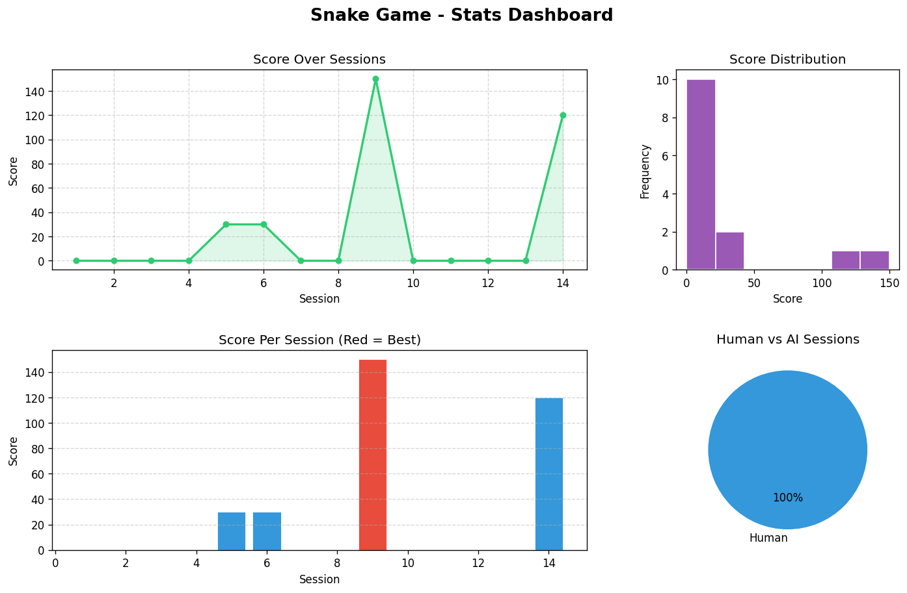
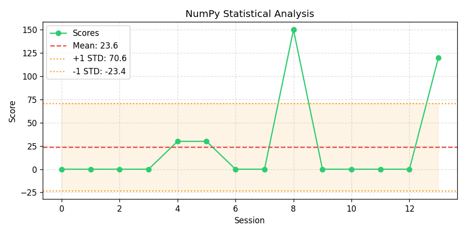

# 🐍 Snake Game + AI Stats Dashboard

A modern Snake game built with **Pygame** featuring an **AI agent**, real-time **stats tracking** with **pandas/numpy**, and beautiful **matplotlib dashboards**. Play yourself or watch the AI play!

---

## ✨ Features

| Feature | Description |
|---------|-------------|
| 🎮 **Human Mode** | Classic snake gameplay with arrow keys |
| 🤖 **AI Mode** | Toggle AI agent that auto-plays using Manhattan distance heuristic |
| 📊 **Stats Tracking** | Every session saved to CSV with pandas |
| 📈 **Matplotlib Dashboard** | Line graphs, bar charts, histograms, pie charts |
| 🔬 **NumPy Analysis** | Mean, std dev, statistical visualization |
| 🏆 **Best Sessions** | Top 5 high scores tracked |

---

## 🚀 Getting Started

### Prerequisites
- Python 3.8+

### Install Dependencies
```bash
pip install -r requirements.txt
```

### Run
```bash
python main.py
```

---

## 🎮 Controls

| Key | Action |
|-----|--------|
| ⬆️⬇️⬅️➡️ | Move snake |
| `A` | Toggle AI mode ON/OFF |
| `R` | Restart after game over |
| `S` | Show Stats Dashboard (matplotlib) |
| `Q` | Quit |

---

## 📸 Screenshots

### Stats Dashboard


### NumPy Analysis


---

## 🛠️ Tech Stack

- **Pygame** — Game engine & graphics
- **Pandas** — Data tracking & CSV I/O
- **NumPy** — Statistical analysis
- **Matplotlib** — Data visualization
- **OOP** — Snake, Food, AIAgent, Game classes

---

## 🗂️ Project Structure

```
.
├── main.py              # Entry point
├── game.py              # Main game loop & Pygame logic
├── snake.py             # Snake & Food classes (OOP)
├── ai_agent.py          # Rule-based AI agent
├── stats.py             # Stats tracking with pandas
├── visualize.py         # Matplotlib dashboards
├── requirements.txt     # Dependencies
├── scores.csv           # Session data (auto-generated)
├── stats_dashboard.png  # Dashboard output
├── numpy_analysis.png   # Analysis output
├── README.md            # This file
├── .gitignore           # Git ignore rules
└── .gitattributes       # Language detection rules
```

---

## 🤖 How the AI Works

The AI agent uses a **Manhattan distance heuristic**:
1. Evaluates all 4 possible directions (excluding reverse)
2. Filters out moves that hit walls or the snake's body
3. Picks the safe move that gets closest to the food

---

## 📊 Stats Tracked

- Total sessions
- Highest / lowest / average score
- Standard deviation & median
- Human vs AI session breakdown
- Top 5 best sessions

---

## 📄 License

This project is for educational purposes.
